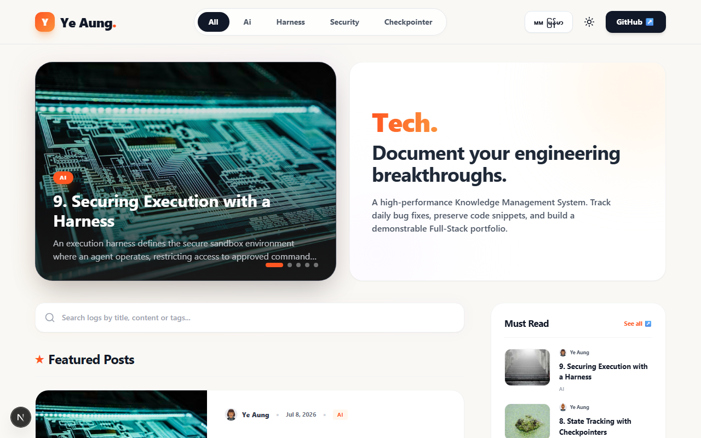

# 📘 Ye Aung — The Notebook

A high-performance developer notebook and Knowledge Management System built with Next.js (App Router), Tailwind CSS, and Supabase.

This platform allows developers to document daily bug fixes, preserve code snippets, and build a demonstrable Full-Stack portfolio.



## ✨ Features

- **Blazing Fast**: Server Components and Supabase for instant page loads.
- **Internationalization (i18n)**: Seamless language toggling between English (`en`) and Myanmar (`mm`).
- **Markdown Editor**: Integrated client-side markdown workspace with a custom formatting toolbar.
- **Real-time Search**: Client-side keyword filtering to instantly find past logs.
- **Mobile Responsive**: Fully optimized UI with responsive sidebars and hero sections.
- **Analytics Ready**: Configured with Vercel Analytics for visitor tracking.
- **Theme Toggle**: Built-in Dark/Light mode support.

## 🚀 Tech Stack

| Layer          | Technology                                   |
| -------------- | -------------------------------------------- |
| **Frontend**   | Next.js 16 (App Router) + Tailwind CSS       |
| **Backend**    | Supabase                                     |
| **Database**   | PostgreSQL (via Supabase)                    |
| **i18n**       | next-intl                                    |
| **Analytics**  | Vercel Analytics                             |
| **Icons**      | Lucide React                                 |

## 🛠️ Getting Started

### 1. Prerequisites
- Node.js (v18 or higher)
- npm or yarn

### 2. Environment Variables
Create a `.env.local` file in the `frontend` directory and add your Supabase credentials:

```env
NEXT_PUBLIC_SUPABASE_URL=your_supabase_url
NEXT_PUBLIC_SUPABASE_ANON_KEY=your_supabase_anon_key
```

### 3. Installation & Setup

```bash
# Clone the repository
git clone https://github.com/iamyeaung/yeaung.git

# Navigate into the frontend directory
cd yeaung/frontend

# Install dependencies
npm install

# Start the development server
npm run dev
```

Visit `http://localhost:3000` in your browser to view the application.

## 📄 License

This project is licensed under the MIT License.
